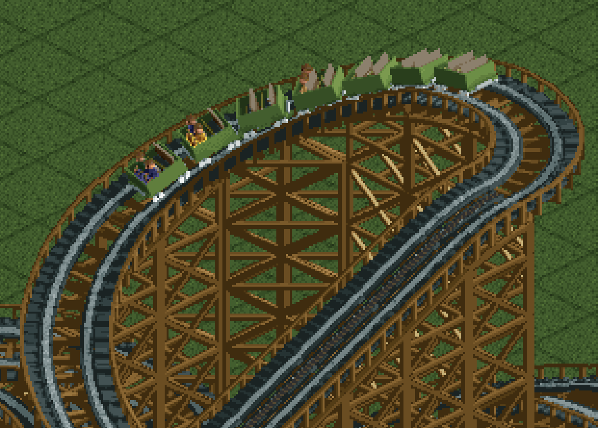

# OpenRCT2 Vehicle Generator

A Blender addon to generate custom ride-vehicle `.parkobj` files for [OpenRCT2](https://openrct2.org/)




Heavily inspired by X7's [RCTGen](https://github.com/X123M3-256/RCTGen) project.

## Documentation

| Guide | For |
|---|---|
| [Add-on installation](doc/blender-plugin-installation.md) | Installing the extension into Blender |
| [Add-on tutorial](doc/blender-plugin-tutorial.md) | Building a working vehicle start-to-finish |
| [Add-on reference](doc/blender-plugin-reference.md) | Every UI control |
| [`openrct2_vehicle_generator/`](openrct2_vehicle_generator/README.md) | The Python core (config → render → `.parkobj`) |
| [`vehicle_renderer_addon/`](vehicle_renderer_addon/README.md) | The Blender add-on internals (for contributors) |
| [Ride config schema](#ride-config) | The YAML/JSON config used by the CLI |

## Requirements

- Windows x64, macOS arm64, Linux x64
  - To-Do: macOS Intel & Linux arm
- Blender 4.2 or newer 

## Quickstart

1. Download the latest version of the Blender add-on [here](https://github.com/alex-parisi/OpenRCT2-VehicleGenerator/releases/latest)
2. Install the add-on into Blender. If you are not sure how, follow [these instructions](doc/blender-plugin-installation.md)
3. Follow the tutorial [here](doc/blender-plugin-tutorial.md)
4. For a reference of every UI setting, see the [add-on reference](doc/blender-plugin-reference.md)

## Material Triggers

Material names trigger special handling. Include one of these substrings to opt in:

   | Substring | Effect |
   |---|---|
   | `Remap1` / `Remap2` / `Remap3` | Player-recolorable (palette regions 1/2/3) |
   | `Greyscale` | Shaded into the greyscale ramp (palette region 4) |
   | `Peep` | Peep palette region (5) |
   | `Mask` | Cutout mask (transparency) |
   | `NoAO` | Skip ambient-occlusion sampling |
   | `Edge` / `DarkEdge` | Background-AA / dark background-AA edges |
   | `NoBleed` | Don't bleed colors across sprite seams |

Mesh OBJs use **+X = direction of travel (front of car)**, **+Y = up**,
**+Z = passenger's right**. Geometry that should lead the moving train must
sit at positive X.

## Project Architecture

This project is composed of three layers:

#### X7 Renderer

The Embree-backed renderer ported from X7's [RCTGen](https://github.com/X123M3-256/RCTGen)
lives in its own package, [`openrct2-x7-renderer`](https://pypi.org/project/openrct2-x7-renderer/)
(C++23 + pybind11), and is installed from PyPI as a dependency. Its wheels
vendor Embree, so there's nothing to compile here. It provides the ray tracer
plus the shared OBJ/MTL parser, RCT2 palette, and `images.dat` packing.

#### Python Package

All vehicle-specific operations (JSON/YAML configuration, the rotation tables,
and the `.parkobj` assembly) are handled by the `openrct2_vehicle_generator`
package in this repo, which calls into `openrct2_x7_renderer` for rendering.

#### Blender Add-On

A proper Blender 4.2+ add-on that vendors the X7 renderer as pre-built wheels, 
statically linking the Embree backend alongside the other OpenRCT2-specific functions.

### Repository layout

```
OpenRCT2-VehicleGenerator/
├── openrct2_vehicle_generator/   # Python core: config -> render -> .parkobj (README inside)
│   ├── __main__.py               #   `openrct2-vehicle-generator` CLI
│   ├── loader.py                 #   config dict -> Ride
│   ├── sprite_renderer.py        #   rotation tables + per-frame render dispatch
│   ├── exporter.py               #   object.json + images.dat + .parkobj zip
│   ├── types.py / constants.py   #   dataclasses + enums / name tables
├── vehicle_renderer_addon/       # Blender 4.2+ add-on (UI + scene adapter; README inside)
│   ├── props.py / panels.py      #   PropertyGroups / sidebar UI
│   ├── operators.py              #   test-render + threaded export
│   ├── scene_to_ride.py          #   bpy -> Mesh adapter
│   ├── track_types.json          #   ride type -> sprite-group requirements
│   └── wheels/                   #   vendored wheels (regenerated by scripts/collect_wheels.py)
├── doc/                          # user-facing add-on guides (+ _static/ screenshots)
├── examples/wooden/              # complete worked example (meshes, config, .blend)
├── scripts/                      # build/codegen helpers (see Development below)
└── tests/                        # pytest suite
```

The lower layers each carry their own README:
[`openrct2_vehicle_generator/`](openrct2_vehicle_generator/README.md) and
[`vehicle_renderer_addon/`](vehicle_renderer_addon/README.md).

## How It Works

Vehicle sprites are generated by ray-tracing your OBJ meshes from every angle
OpenRCT2 needs, then quantizing each frame into the game's 256-color palette.
The loader parses a ride config (YAML or JSON), resolves the referenced `.obj`
and `.mtl` files, and classifies each material by name. `Remap1`/`Remap2`/`Remap3`
regions become player-recolorable, `Peep` maps to its dedicated palette slot, and
`Mask` materials become transparent cutouts. Geometry, textures, and lights go to
a native C++ extension built on Embree 4. It holds the BVH and runs the per-pixel
work: 4×4 supersampling for anti-aliasing, 8×4 hemisphere samples for ambient
occlusion, Blender-style specular shading, and Floyd-Steinberg dither when
collapsing each pixel to a palette index.

For every sprite group enabled in the config (flat, gentle slopes, banked
turns, corkscrews, and the rest) the renderer steps a vehicle through the
rotations OpenRCT2 expects and emits one indexed-color frame per view. With
`restraint_animation` set it emits four animation frames per view instead. All
frames are concatenated into a single `images.dat` blob, laid out the way vanilla
rides ship. An `object.json` references it via OpenRCT2's `$LGX:` syntax, and the
pair is zipped into a `.parkobj` ready to drop into your `object/` folder.

## CLI Usage

### Ride Config

A ride config is a single YAML (or JSON) document. All paths inside it are
resolved relative to the current working directory at render time. See
[`examples/wooden/classic_wooden.yaml`](examples/wooden/classic_wooden.yaml)
for a complete, working file.

#### Top-level fields

| Key | Required | Type | Notes                                                                                                                                                                                                                         |
|---|---|---|-------------------------------------------------------------------------------------------------------------------------------------------------------------------------------------------------------------------------------|
| `id` | yes | string | Object id. Use your own namespace (e.g. `myname.ride.foo`). Colliding with a vanilla id (`rct1.ride.*`, `rct2.ride.*`) prevents the engine from picking your object cleanly.                                                  |
| `name` | yes | string | Display name in the build menu.                                                                                                                                                                                               |
| `description` | yes | string | Shown in the object picker.                                                                                                                                                                                                   |
| `capacity` | yes | string | Human-readable rider count (e.g. `"4 passengers per car"`). The actual seat count is derived from `riders` below.                                                                                                             |
| `ride_type` | yes | string | One of the keys in [`vehicle_renderer_addon/track_types.json`](vehicle_renderer_addon/track_types.json) (e.g. `classic_wooden_rc`, `steel_rc`, `suspended_swinging_rc`). Determines which track-piece sprites OpenRCT2 expects and which sprite groups are valid. |
| `units_per_tile` | no | number | OBJ units that map to one OpenRCT2 tile. Sets the render scale (sprite size) **and** the model→game-unit conversions for `spacing` and rider positions, so they stay consistent. Defaults to `3.3` (RCT2's realistic metres-per-tile). Use `1.0` to author in tiles. |
| `authors` | no | string or string[] | Credited in the object metadata.                                                                                                                                                                                              |
| `version` | no | string | Defaults to `1.0`.                                                                                                                                                                                                            |
| `original_id` | no | string | Set if you are reskinning a vanilla object.                                                                                                                                                                                   |
| `preview` | no | path | PNG to use as the object-picker thumbnail. Read with the RCT2 palette.                                                                                                                                                        |
| `meshes` | yes | path[] | OBJ files in load order. Each one becomes an index referenced by `mesh_index` below.                                                                                                                                          |
| `sprites` | yes | `"all"` or string[] | Which sprite groups to render. See list below. `"all"` enables every group.                                                                                                                                                   |
| `flags` | no | string[] | Ride-level flags: `no_collision_crashes`, `rider_controls_speed`.                                                                                                                                                             |
| `min_cars_per_train` | yes | int |                                                                                                                                                                                                                               |
| `max_cars_per_train` | yes | int |                                                                                                                                                                                                                               |
| `zero_cars` | no | int | Number of cars at the front that carry no riders (engines, etc.). Defaults to 0.                                                                                                                                              |
| `preview_tab_car` | no | int | Index of the car shown in the build-menu preview. Defaults to 0.                                                                                                                                                              |
| `build_menu_priority` | no | int | Sort order in the build menu.                                                                                                                                                                                                 |
| `running_sound` | yes | string | One of `wooden_old`, `wooden`, `steel`, `steel_smooth`, `waterslide`, `train`, `engine`.                                                                                                                                      |
| `secondary_sound` | yes | string | One of `scream1`, `scream2`, `scream3`, `whistle`, `bell`.                                                                                                                                                                    |
| `default_colors` | yes | [color, color, color][] | One to three build-menu presets. Each preset is `[main, additional, tertiary remap]`. See color names below.                                                                                                                  |
| `configuration` | no | object | Maps car positions to indices into `vehicles`. Keys: `default` (required if present), `front`, `second`, `third`, `rear`. Single-car-type rides omit this entirely and default to `vehicles[0]` everywhere.                   |
| `vehicles` | yes | object[] | At least one. See vehicle fields below.                                                                                                                                                                                       |

#### Sprite groups

Names accepted in `sprites:` -
`flat`, `gentle_slopes`, `steep_slopes`, `vertical_slopes`, `diagonals`,
`banked_turns`, `inline_twists`, `slope_bank_transition`,
`diagonal_bank_transition`, `sloped_bank_transition`, `banked_sloped_turns`,
`banked_slope_transition`, `corkscrews`, `zero_g_rolls`,
`diagonal_sloped_bank_transition`, `dive_loops`.

The loader ORs in implied groups: enabling `banked_turns` adds
`diagonal_bank_transition` (and, combined with slopes, the relevant
slope/bank transitions); enabling `dive_loops` adds `zero_g_rolls`.

#### Vehicle entry

| Key | Required | Type | Notes                                                                                                                                                                                                                                                                        |
|---|---|---|------------------------------------------------------------------------------------------------------------------------------------------------------------------------------------------------------------------------------------------------------------------------------|
| `mass` | yes | int |                                                                                                                                                                                                                                                                              |
| `spacing` | yes | number | Distance between car centers along the track.                                                                                                                                                                                                                                |
| `draw_order` | yes | int | Z-sort hint within a train.                                                                                                                                                                                                                                                  |
| `effect_visual` | no | int | Defaults to 1.                                                                                                                                                                                                                                                               |
| `flags` | no | string[] | `secondary_remap`, `tertiary_remap`, `riders_scream`, `restraint_animation`. Setting `restraint_animation` makes the renderer emit 4 animation frames per sprite.                                                                                                            |
| `model` | yes | object[] | Mesh placements that make up the car body. See below.                                                                                                                                                                                                                        |
| `riders` | no | object[][] | Each entry is one **seat row**; each row is a list of peep placements (e.g. left + right). The total peep count across all rows is the car's seat count. Using N single-peep entries makes the engine treat the car as having N rows. Match the ride type's expected layout. |

#### Model / rider entries

A model entry is `{mesh_index, position, orientation}`:

- `mesh_index`: int (index into the top-level `meshes` list), or a 4-element
  list when `restraint_animation` is set and you want a different mesh per
  frame. `-1` means "no mesh this frame".
- `position`: `[x, y, z]` in OBJ space (+X = front of car, +Y = up,
  +Z = passenger's right). Defaults to `[0, 0, 0]`. For animated parts, may
  be a list of 4 `[x, y, z]` values. One per frame.
- `orientation`: `[a, b, c]` Euler angles in degrees, applied as
  `rotate_y(a) * rotate_z(b) * rotate_x(c)`. `[0, 90, 0]` rotates around the
  cross-car axis, **not** the vertical axis. Same per-frame list rule as
  `position`: a 4-entry list animates rotation across the restraint frames.

YAML anchors (`&name` / `*name`) are handy for sharing one animation curve
across several parts. The wooden example uses one for the lap-bar sweep.

#### Iteration

```bash
# Quick single-viewpoint render per frame, written to test/. Fast.
uv run openrct2-vehicle-generator --test path/to/ride.yaml

# Full render: writes object/ and <id>.parkobj in the current directory.
uv run openrct2-vehicle-generator path/to/ride.yaml
```

All paths in the ride YAML (`meshes`, `preview`, and `map_Kd` lines in `.mtl`
files) are resolved relative to the **current working directory**, so run from
the repo root unless you've copied the assets elsewhere.

## Development

### Requirements

- Python >= 3.11
- [uv](https://docs.astral.sh/uv/)

That's it. This repo is pure Python. The renderer (`openrct2-x7-renderer`)
installs from PyPI as a prebuilt, Embree-vendored wheel, so no compiler, CMake,
or Embree is needed.

```bash
uv sync --group dev   # install the package + dev tools (pytest, ruff, mypy, yamllint)
```

### Tests, lint, and types

```bash
uv run pytest             # unit tests; coverage of openrct2_vehicle_generator on by default
uv run ruff check .       # lint (E, F, I, UP, B, W, N)
uv run mypy               # type-check openrct2_vehicle_generator
uv run yamllint examples  # validate the example configs
```

`pytest` enables coverage automatically (`--cov=openrct2_vehicle_generator`, see
`pyproject.toml`). The same four checks run in CI on every push/PR
(`.github/workflows/pytest.yml`, `lint.yml`).

### Environment variables

| Variable | Effect |
|---|---|
| `OPENRCT2VG_RENDER_THREADS` | Worker threads issuing concurrent sprite renders. Defaults to `min(8, cpu_count)`; set `1` to force serial. Output is byte-identical regardless. |
| `OPENRCT2_X7_NUM_THREADS` | The renderer's own per-pixel thread pool (see the X7 repo). |

### Scripts

| Script | Purpose |
|---|---|
| [`scripts/build_plugin_local.py`](scripts/build_plugin_local.py) | Build a single-platform extension zip for the Blender on your machine (macOS). |
| [`scripts/collect_wheels.py`](scripts/collect_wheels.py) | Download deps + renderer wheels and regenerate the add-on's `wheels/` and manifest. |
| [`scripts/build_track_types.py`](scripts/build_track_types.py) | Regenerate `track_types.json` from an `objects-master` checkout. |
| [`scripts/build_wooden_car.py`](scripts/build_wooden_car.py), [`build_wooden_restraint.py`](scripts/build_wooden_restraint.py) | Procedurally rebuild the `examples/wooden` meshes (run in Blender). |
| [`scripts/ci/set_version.py`](scripts/ci/set_version.py) | Stamp a release version into `pyproject.toml` + the manifest (used by CI). |

### Building the Blender add-on

See [`vehicle_renderer_addon/README.md`](vehicle_renderer_addon/README.md#building-the-extension)
for the local build and the wheel-bundling model. Multi-platform release zips are
produced by `.github/workflows/build-plugin.yml` on a `v*` tag.

To hack on the renderer itself (C++/Embree/CMake), see its repo,
[OpenRCT2-X7-Renderer](https://github.com/alex-parisi/OpenRCT2-X7-Renderer).

## License

GPL-3.0-or-later. This front-end depends on
[openrct2-x7-renderer](https://github.com/alex-parisi/OpenRCT2-X7-Renderer),
which is also GPL-3.0-or-later and whose distributed wheels bundle Embree and
TBB (Apache-2.0).
