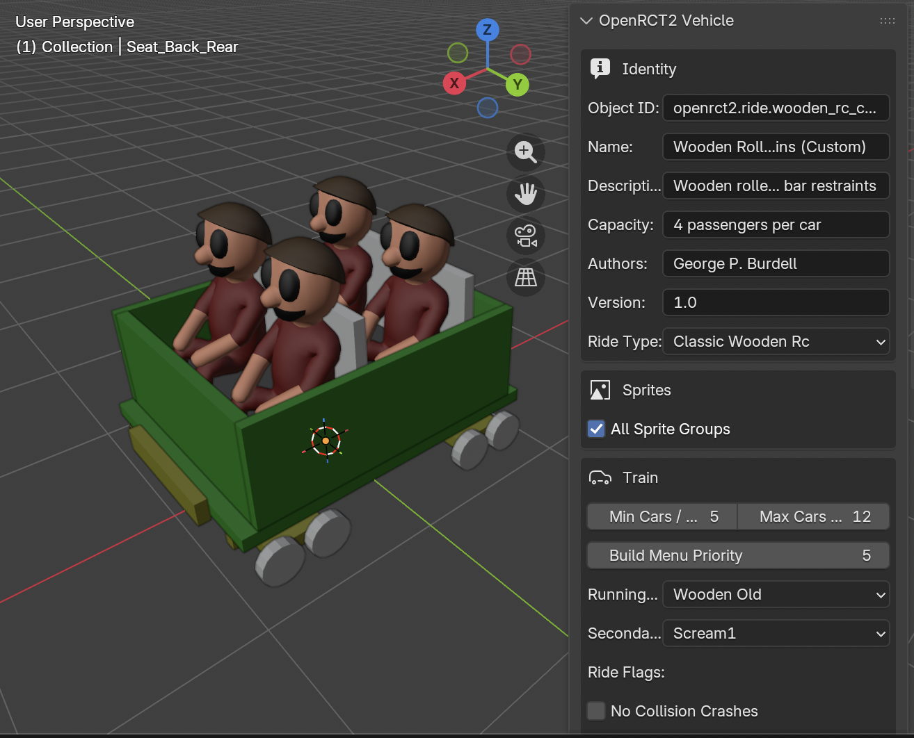

# OpenRCT2 Vehicle Generator

A Blender addon to generate custom ride-vehicle `.parkobj` files for [OpenRCT2](https://openrct2.org/)



Heavily inspired by X7's [RCTGen](https://github.com/X123M3-256/RCTGen) project.

## Requirements

- Windows x64, macOS arm64, Linux x64
  - To-Do: macOS Intel & Linux arm
- Blender 4.2 or newer 

## Quickstart

1. Download the latest version of the Blender add-on [here](https://github.com/alex-parisi/OpenRCT2-VehicleGenerator/releases/latest)
2. Install the add-on into Blender. If you are not sure how, follow [these instructions](doc/blender-plugin-installation.md)
3. Follow the tutorial [here]()

## CLI Usage

#### WIP

```bash
# Full render -> writes object/ and <id>.parkobj in the current directory
uv run openrct2-vehicle-generator path/to/ride.yaml

# Quick single-viewpoint render per frame (no full sprite set).
# Outputs to test/ for fast visual iteration.
uv run openrct2-vehicle-generator --test path/to/ride.yaml

# Reuse sprites from a previous full run; rebuild object.json + .parkobj only
uv run openrct2-vehicle-generator --skip-render path/to/ride.yaml
```

All paths in the ride JSON (`meshes`, `preview`, and `map_Kd` lines in `.mtl`
files) are resolved relative to the **current working directory**, so run from
the repo root unless you've copied the assets elsewhere.

## Examples

One example vehicle ships under `examples/`:


| Example   | Ride type           | Notes                                                                                                                                                                                                                                 |
| --------- | ------------------- | ------------------------------------------------------------------------------------------------------------------------------------------------------------------------------------------------------------------------------------- |
| `wooden/` | `classic_wooden_rc` | A 4-rider classic wooden car (2 rows × 2 seats, lap-bar restraint animation, 8 custom lights). Meshes are generated procedurally by the`scripts/build_wooden_*.py` Blender scripts. Renders all 16 sprite groups via `sprites: all`. |

Shared `textures/` (chassis, metal, seat, and remap-gradient textures) are
referenced from each example's `materials.mtl`. Every example sets a custom
`id` in the `openrct2vg.ride.*` namespace so its output never collides with a
vanilla OpenRCT2 object.

## How it works

The renderer's hot path (Embree scene management, anti-aliasing, ambient
occlusion, specular shading, and palette dithering) lives in a small C++
extension built from a curated subset of OpenRCT2's `iso-render`. Everything
else — OBJ/MTL parsing, JSON loading and validation, sprite-group dispatch, and
`.parkobj` packaging — is plain Python. See [`CLAUDE.md`](CLAUDE.md) for the
full architecture, the `images.dat` sprite format, and OpenRCT2 format gotchas
worth knowing.

## Tests

```bash
uv run pytest
```

The Python suite covers everything that doesn't need Embree (palette tables,
OBJ/MTL parsing, atlas packing, the `images.dat` format, and JSON validation),
with the renderer stubbed so it runs without the native extension. The native
C++ has its own unit tests under `x7_renderer/test/`.

## Development

### Requirements

- Python >= 3.11
- CMake >= 3.25
- A C++23 compiler (clang, gcc13+, MSVC)
- Embree 4
  - macOS: `brew install embree`
  - Linux: see [scripts/ci/install_embree_linux.sh](scripts/ci/install_embree_linux.sh)
  - Windows: the RenderKit release zip pointed to via `EMBREE_ROOT`
- uv

**Optional**
- GTest
- LLVM clang-format + clang-tidy
