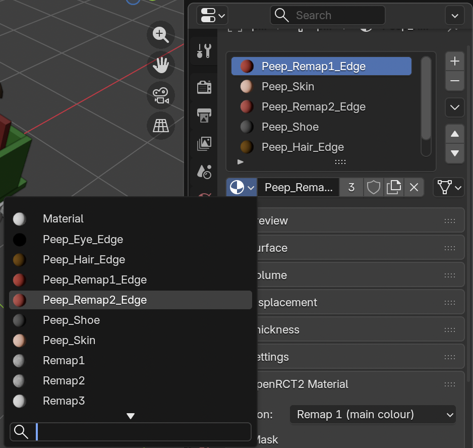

# OpenRCT2-VehicleGenerator Blender Plugin Tutorial

After [installing the plugin](blender-plugin-installation.md), you can follow this tutorial 
to generate a very basic vehicle for the Classic Wooden Roller Coaster from RCT1.

**NOTE**: This tutorial assumes you have the RCT1 assets installed in OpenRCT2. If you do 
not, use another similar ride that you do have the assets for.

Peep model is borrowed from X7's [RCTGen](https://github.com/X123M3-256/RCTGen) project.

The vehicle model and restraint model are built procedurally using 
[build_wooden_car.py](../scripts/build_wooden_car.py) and 
[build_wooden_restraint.py](../scripts/build_wooden_restraint.py)

## Download the Example files

You'll need all the files in [examples/wooden](../examples/wooden), except `classic_wooden.yaml`. 

Download or clone the repo so that you have these files handy.

Or, you can use your own object/material files, but you're on your own :)

## Vehicle Body

### Open Blender and Import the Car Object

Start with a completely empty scene: no objects, no cameras, no lights.

**Import the `car.obj` file:**

File --> Import --> Wavefront

**Then select the `car.obj` file:**

### Assign "Body" Role to Car

After importing the object, all the meshes should be still be selected. While they are all 
selected, go to the "Object Panel" on the right side, and scroll down the "OpenRCT2 Vehicle" 
section. Select the "Body" role.

Then, right click on the "Body" role, and press "Copy to Selected" to ensure that all of the 
car meshes have the "Body" role.

All meshes associated with the vehicle car need to get assigned this role.

### Assign Color Remap Meshes

Open the "Material" tab on the right side.

In the current example, the vehicle "car" is Remap1, the seat backs are Remap2, and the trucks 
(underside of the vehicle) are Remap3. The wheels are assigned the "Wheel" material which is not 
used, and leaves them as the color they're currently rendering at.

When recoloring a train in OpenRCT2, the first color picker dropdown corresponds to the meshes 
assigned Remap1, and so on. This allows you to control which surfaces get recolored.

Shift-click the walls and the floor of the car, and in the "OpenRCT2 Material" section, set the 
"Region" to "Remap 1".

Do the same for the seat backs, and assign them to "Remap 2".

Finally, do the same for the trucks beneath the car (not the wheels though!), and assign them 
"Remap 3".

If you are using existing materials, just ensure that the material name includes "_Remap1_" in 
the name at some point if you want meshes assigned that material to be remapped to region 1. Do 
the same for "_Remap2_" and "_Remap3_".

Feel free to change them how you like.

### Checklist

- All meshes assigned to the "Body" role in the "OpenRCT2 Vehicle" section of the "Objects" tab
- Remap materials assigned to respective meshes

## Riders

### Import the Peep Object

Just like `car.obj`, import `peep.obj` into the Scene.

While it's highlighted, open the "Object" panel, and assign it the "Rider set" role.

When designing a car with two rows of seats, the rider row index of 0 corresponds to the 
front row, and index 1 corresponds to the back row. Ensure the peeps that are placed in these 
rows have the correct index.

First, move the peep into the top-left seat of the car. About here should do it:

Then, copy and paste this peep model into the other seats. You can do this by selecting 
the peep model, then pressing Shift+D, and then Esc. Then use the move tool to move the copied 
mesh. 

As mentioned above, ensure all the peep meshes are assigned the "Rider set" role, and that 
the peeps in the front row have the "Rider Row" value set to 0, and to 1 for the peeps in the 
back.

### Assign Color Remap Meshes

Ensure that the material used on the peeps shirts are assigned the correct remap region. This 
ensures the peeps will maintain the color of their shirt when boarding. Use "_Remap1_" for peeps 
on the left, and "_Remap2_" for peeps on the right.

The current peep model assigns "Peep_Remap1_Edge" to the shirt and "Peep_Remap2_Edge" to the 
pants, which is a little problematic for this example. We need the shirt for the peeps on the 
_left_ side of the vehicle to be "_Remap1_" and the shirt for the peeps on the _right_ side 
to be "_Remap2_".

First, click the peep in the front-left seat, and with the "Peep_Remap1_Edge" material selected, 
in the "OpenRCT2 Material" section, set the "Region" to "Remap 1".

Then click the peep in the front-right seat, and then select the "Peep_Remap1_Edge" material. 
Change the material to "Peep_Remap2_Edge":

And then in the "OpenRCT2 Material" section, set the "Region" to "Remap 2". Repeat this process 
for the peep sitting in the back-right seat.

### Checklist

- Place the peep model(s) in the seats you want peeps to sit at in-game.
- Assign the peep mesh to the "Rider seat" role
- Ensure that peeps in the front row have the "Rider Row" value set to 0
- Ensure that peeps in the back row have the "Rider Row" value set to 1
- Set the material for the shirt of the peeps on the left side to "_Remap1_"
- Set the material for the shirt of the peeps on the right side to "_Remap2_"

## Restraint

### Import the Restraint Object

Just like `car.obj` and `peep.obj`, import `restraint.obj` into the Scene.

While it's highlighted, open the "Object" panel, and assign it the "Restraint" role.
For this example, you can leave the pivot value set to 90 degrees.

They key thing to remember here is that the restraint meshes will pivot around their origin.
In the example restraint, you can see the origin for all the restraint meshes is a good pivot 
point:

Copy these meshes and put a restraint for the back row as well:

### Checklist

- Ensure all restraint meshes are assigned the "Restraint" role.
- Ensure that the origin for all the restraint meshes is the central pivot point.

## Plugin Usage

### Settings

Now, press "N", and then select "OpenRCT2" on the right side.

We'll be using most of the information in the [classic_wodden.yaml](../examples/wooden/classic_wooden.yaml)
file, which is based on the original wooden vehicle json file [here](https://github.com/OpenRCT2/objects/blob/master/objects/rct1/ride/rct1.ride.wooden_rc_trains/object.json)

It is HIGHLY recommended to use settings for a vanilla ride that uses the track-type 
you are targeting. Settings like "Build Menu Priority", "Draw Order", and "Effect Visual" 
are hard to figure out and can lead to glitchy cars if not properly set. Explore the 
[objects](https://github.com/OpenRCT2/objects) repo for vehicle types.

### Render Preview

We're now ready to see how it would look in-game!

In the top bar, click the "UV Editing". A new window should appear side-by-side with the 
layout window. Ensure that "Show Gizmo" and "Show Overlays" are disabled:

Back in the OpenRCT2 Vehicle plugin, scroll down and press "Test Render".

You should see a preview of the car!

### Export

Press the "Export .parkobj" button at the bottom, and save the file to a known location.

## Installing & Using In-Game

Drag-and-Drop (or copy) the `.parkobj` file to the OpenRCT2 object folder. On macOS, this 
will be `~/Library/Application\ Support/OpenRCT2/object`.

Launch the game, and it should be available as an option in the Object Selection menu.

I recommend having a scenario with every ride type enabled, so this way you can create a new 
game, immediately open the Object Selection menu, and see _only_ the new vehicle you added.

Build the targeted ride, select your new vehicle, and give it a test. Make sure everything 
looks as expected!

