# OpenRCT2-VehicleGenerator Blender Plugin Tutorial

After [installing the plugin](blender-plugin-installation.md), you can follow this tutorial 
to generate a very basic vehicle for the Classic Wooden Roller Coaster from RCT1.

**NOTE**: This tutorial assumes you have the RCT1 assets installed in OpenRCT2. If you do 
not, use another similar ride that you do have the assets for.

Peep model is borrowed from X7's [RCTGen](https://github.com/X123M3-256/RCTGen) project.

The vehicle model and restraint model are built procedurally using 
[build_wooden_car.py](../scripts/build_wooden_car.py) and 
[build_wooden_restraint.py](../scripts/build_wooden_restraint.py)

## Download the Example files

You'll need all the files in [examples/wooden](../examples/wooden), except `classic_wooden.yaml`. 

Download or clone the repo so that you have these files handy.

Or, you can use your own object/material files, but you're on your own :)

## Vehicle Body

### Open Blender and Import the Car Object

Start with a completely empty scene: no objects, no cameras, no lights.

**Import the `car.obj` file:**

File --> Import --> Wavefront

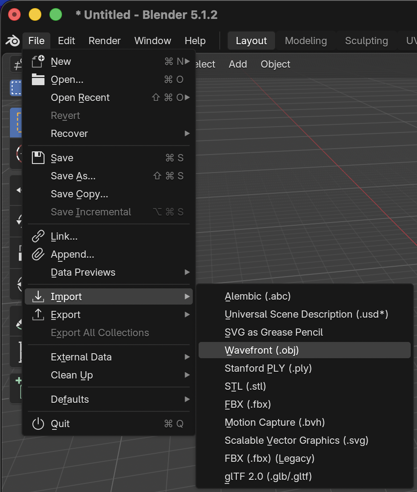

**Then select the `car.obj` file:**

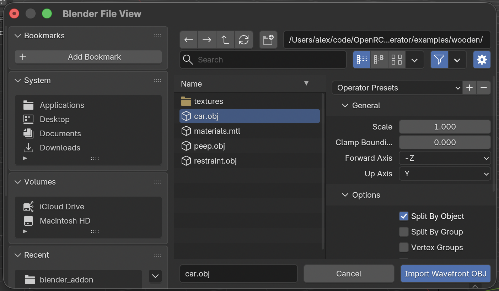

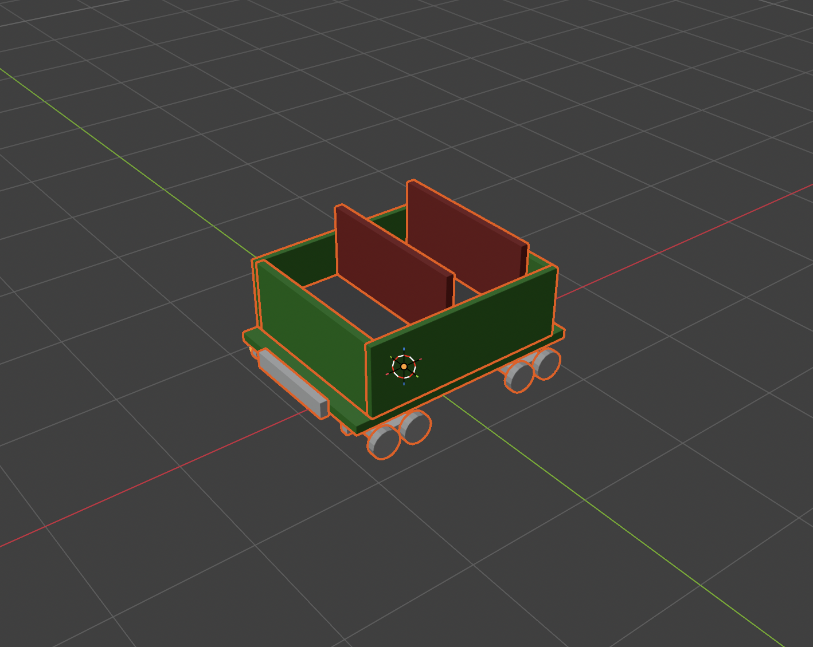

### Assign "Body" Role to Car

After importing the object, all the meshes should be still be selected. While they are all 
selected, go to the "Object Panel" on the right side, and scroll down the "OpenRCT2 Vehicle" 
section. Select the "Body" role.

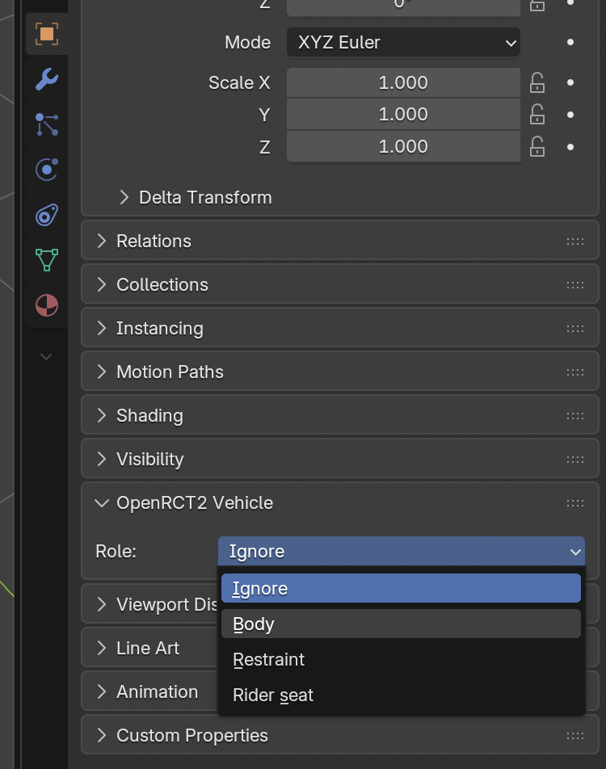

Then, right click on the "Body" role, and press "Copy to Selected" to ensure that all of the 
car meshes have the "Body" role.

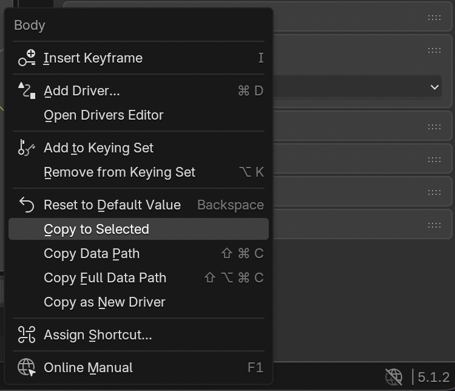

All meshes associated with the vehicle car need to get assigned this role.

### Assign Color Remap Meshes

Open the "Material" tab on the right side.

In the current example, the vehicle "car" is Remap1, the seat backs are Remap2, and the trucks 
(underside of the vehicle) are Remap3. The wheels are assigned the "Wheel" material which is not 
used, and leaves them as the color they're currently rendering at.

When recoloring a train in OpenRCT2, the first color picker dropdown corresponds to the meshes 
assigned Remap1, and so on. This allows you to control which surfaces get recolored.

Shift-click the walls and the floor of the car, and in the "OpenRCT2 Material" section, set the 
"Region" to "Remap 1".

Do the same for the seat backs, and assign them to "Remap 2".

Finally, do the same for the trucks beneath the car (not the wheels though!), and assign them 
"Remap 3".

If you are using existing materials, just ensure that the material name includes "_Remap1_" in 
the name at some point if you want meshes assigned that material to be remapped to region 1. Do 
the same for "_Remap2_" and "_Remap3_".

Feel free to change them how you like.

### Material Appearance: Color & Shininess

A material's look comes from its **Principled BSDF** node in the Shading
workspace (or the Material Properties tab), which is the same shader you'd use 
for any Blender render:

- **Base Color** sets the flat surface colour. (For a remappable region the
  colour is ignored in-game and replaced by the player's chosen colour, but it
  still drives the greyscale shading, so a mid-grey reads best.) You can also
  plug an **Image Texture** node into Base Color instead of using the add-on's
  explicit Texture field.
- **Metallic** controls how the highlight is tinted. Leave it at `0` for
  painted/plastic/wood surfaces (a neutral grey highlight); raise it toward `1`
  for metal, where the highlight takes on the base colour like real polished
  metal (chrome rails, brass trim).
- **Roughness** controls how sharp the highlight is. Low roughness gives a
  tight, glossy highlight (polished metal, glass); high roughness gives a
  broad, soft, matte look (wood, fabric).

So to make a shiny chrome rail: set Metallic near `1` and Roughness low. For a
matte wooden body: Metallic `0`, Roughness high.

> The "OpenRCT2 Material" section does not have a specular slider anymore. 
> Shininess is read from the shader's Metallic/Roughness inputs, so you tune 
> the look the same way you would for any Blender material.

### Checklist

- All meshes assigned to the "Body" role in the "OpenRCT2 Vehicle" section of the "Objects" tab
- Remap materials assigned to respective meshes

## Riders

### Import the Peep Object

Just like `car.obj`, import `peep.obj` into the Scene.

While it's highlighted, open the "Object" panel, and assign it the "Rider set" role.

First, move the peep into the top-left seat of the car. About here should do it:

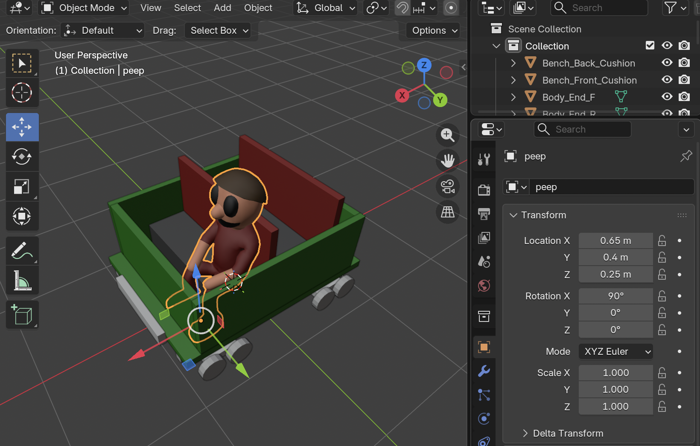

Then, copy and paste this peep model into the other seats. You can do this by selecting 
the peep model, then pressing Shift+D, and then Esc. Then use the move tool to move the copied 
mesh. 

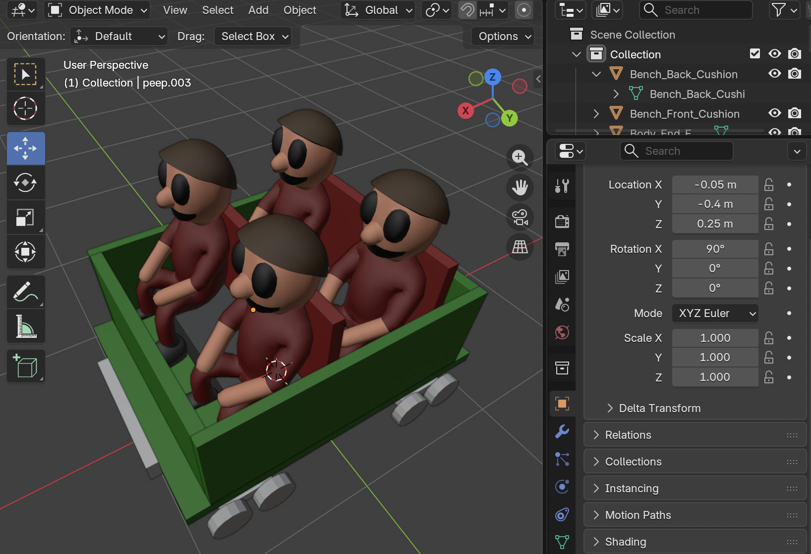

Ensure all the peep meshes are assigned the "Rider set" role.

Each peep also has a **Rider Number** field in the Object panel. The exporter sorts 
peeps by this number and pairs them into seat rows: numbers 0 and 1 form the first row, 
2 and 3 form the second, and so on. For the 2x2 wooden car above, set the two front-row 
peeps to 0 and 1, and the two back-row peeps to 2 and 3. OpenRCT2 only supports pairs of 
riders per row (or a single rider for one-seat cars).

### Assign Color Remap Meshes

The peep's recolorable material (e.g. the shirt) just needs to be marked as a remappable 
region so it keeps the rider's colour when boarding. You **don't** have to pick Remap1 vs 
Remap2 per seat yourself, and the exporter assigns those automatically from each peep's position 
in its seat row: the **left** peep (the lower Rider Number in the pair) gets Remap1, and the 
**right** peep gets Remap2. So you can set the shirt material to "Remap 1" on every peep (or 
just leave the model's existing remappable shirt material as-is) and the sides sort themselves 
out.

Click a peep, select its shirt material, and in the "OpenRCT2 Material" section set the 
"Region" to any remappable region ("Remap 1" is fine for all of them).

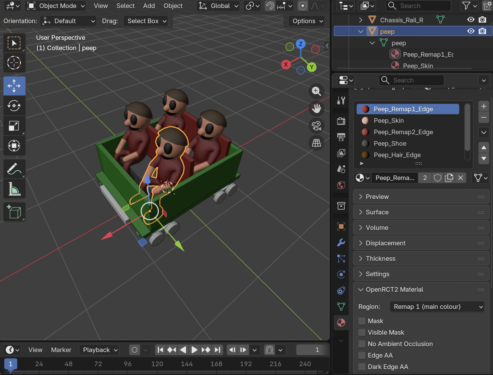

Only materials you mark remappable are touched. Skin, hair, and shoes are left alone. If you 
deliberately want a peep's accent to follow the ride's **tertiary** colour, set that material 
to "Remap 3": Remap3 is preserved and never overwritten by the left/right auto-assignment.

### Checklist

- Place the peep model(s) in the seats you want peeps to sit at in-game.
- Assign the peep mesh to the "Rider seat" role
- Set each peep's "Rider Number" so that the two peeps sharing a row get consecutive values (0/1 for the first row, 2/3 for the second, etc.)
- Mark the peep's shirt material as a remappable region

## Restraint

### Import the Restraint Object

Just like `car.obj` and `peep.obj`, import `restraint.obj` into the Scene.

While it's highlighted, open the "Object" panel, and assign it the "Restraint" role.
For this example, you can leave the pivot value set to 90 degrees.

They key thing to remember here is that the restraint meshes will pivot around their origin.
In the example restraint, you can see the origin for all the restraint meshes is a good pivot 
point:

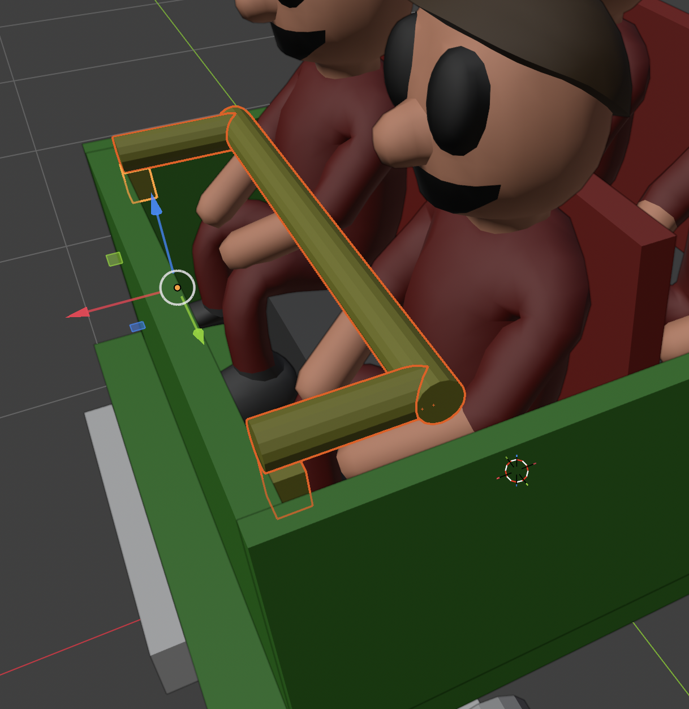

Copy these meshes and put a restraint for the back row as well:

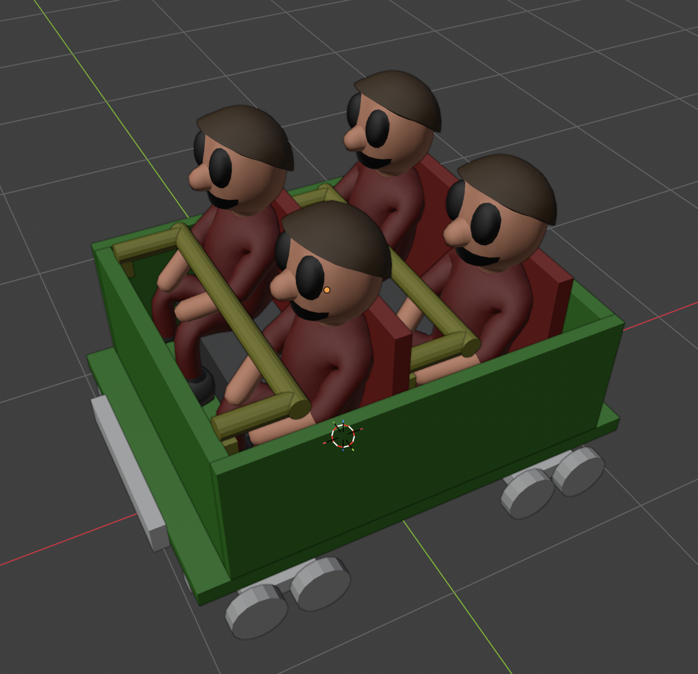

### Animation: Swing degrees vs. keyframes

The Restraint role panel exposes two ways to drive the 4-frame restraint animation
OpenRCT2 expects:

- **Restraint Swing** (degrees): the simple path. The add-on linearly
  interpolates the bar from 0° to your value across the 4 frames, swinging
  around the object's origin. Good enough for a classic lap bar.
- **Keyframes on the restraint object's transform**: for anything more
  expressive. If the restraint object has *any* keyframes (rotation,
  translation, or both), the add-on samples its world transform at 4
  evenly-spaced scene frames between `Anim Start Frame` and `Anim End Frame`
  (also on the Restraint panel) and ignores the Swing value. This lets you
  use Blender's graph editor for easing, multi-axis swings, shoulder bars
  that drop *then* slide forward, etc. You can also scrub the timeline
  in Blender to preview the motion before rendering.

Set the rest-pose keyframe at `Anim Start Frame`; the mesh is extracted at
that frame, so whatever orientation the restraint has there becomes frame 0
of the animation.

### Checklist

- Ensure all restraint meshes are assigned the "Restraint" role.
- Ensure that the origin for all the restraint meshes is the central pivot point.
- If you keyframed the restraint, set `Anim Start Frame` / `Anim End Frame`
  to the timeline range that contains your animation.

## Plugin Usage

### Settings

Now, press "N", and then select "OpenRCT2" on the right side.

We'll be using most of the information in the [classic_wodden.yaml](../examples/wooden/classic_wooden.yaml)
file, which is based on the original wooden vehicle json file [here](https://github.com/OpenRCT2/objects/blob/master/objects/rct1/ride/rct1.ride.wooden_rc_trains/object.json)

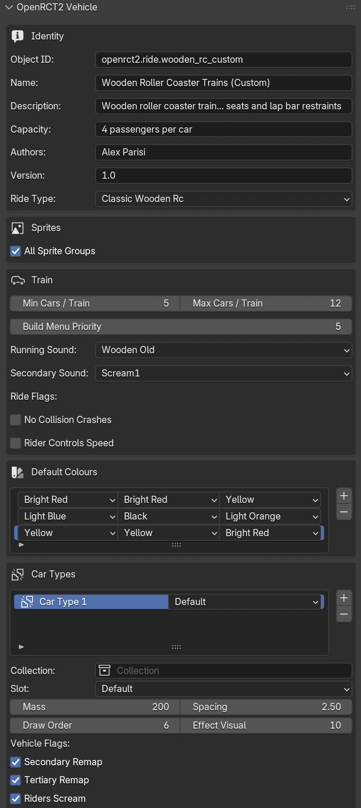

It is HIGHLY recommended to use settings for a vanilla ride that uses the track-type 
you are targeting. Settings like "Build Menu Priority", "Draw Order", and "Effect Visual" 
are hard to figure out and can lead to glitchy cars if not properly set. Explore the 
[objects](https://github.com/OpenRCT2/objects) repo for vehicle types.

Under the **Train** section you can set "Min Cars / Train" and "Max Cars / Train", 
which control how many cars a train can have. The **Zero Cars** field sets how many 
cars at the *front* of the train carry no riders, like engines, decorative locomotives, or 
leading dummy cars. Those cars are still rendered as part of the train, but the engine 
won't seat any peeps in them. Leave it at `0` (the default) for a train where every car 
holds riders.

### Render Preview

We're now ready to see how it would look in-game!

In the top bar, click the "UV Editing". A new window should appear side-by-side with the 
layout window. Ensure that "Show Gizmo" and "Show Overlays" are disabled:

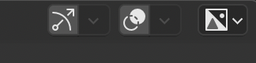

Back in the OpenRCT2 Vehicle plugin, scroll down and press "Test Render".

You should see a preview of the car!

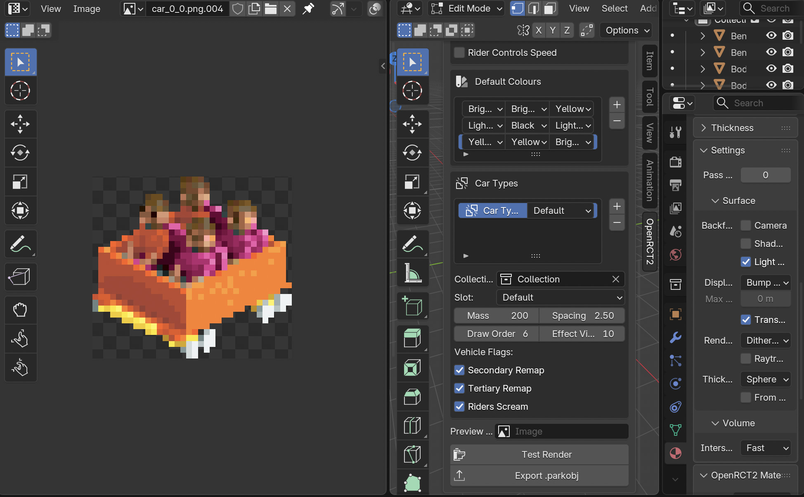

### Export

Press the "Export .parkobj" button at the bottom, and save the file to a known location.

## Installing & Using In-Game

Drag-and-Drop (or copy) the `.parkobj` file to the OpenRCT2 object folder. On macOS, this 
will be `~/Library/Application\ Support/OpenRCT2/object`.

Launch the game, and it should be available as an option in the Object Selection menu.

I recommend having a scenario with every ride type enabled, so this way you can create a new 
game, immediately open the Object Selection menu, and see _only_ the new vehicle you added.

Build the targeted ride, select your new vehicle, and give it a test. Make sure everything 
looks as expected!

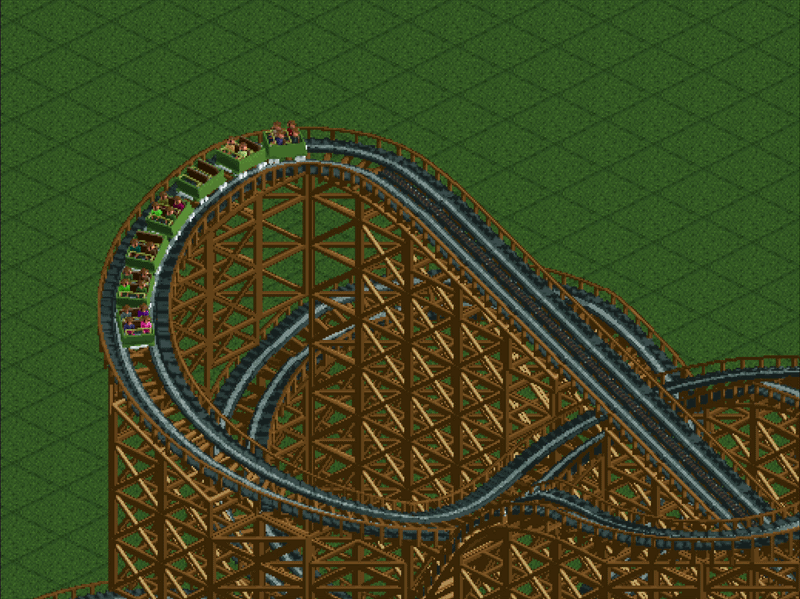