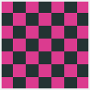

# OpenRCT2 Vehicle Generator

Generate custom ride-vehicle `.parkobj` files for [OpenRCT2](https://openrct2.org/)
from a JSON config and a handful of OBJ meshes. The tool ray-traces the full
set of dimetric sprites — every rotation, slope, and bank — and writes a
`.parkobj` you can drop straight into OpenRCT2's object folder.

A full single-rail coaster vehicle (~4,640 sprites across two car types with
restraint animation) renders in **~10 seconds** on a modern Mac.



## Features

- One command turns a ride config (YAML or JSON) + meshes into an installable `.parkobj`.
- Embree-backed renderer with anti-aliasing, ambient occlusion, specular
  shading, and palette dithering.
- Player-recolorable regions, peep seating, and animated restraints.
- Renders all 16 sprite groups, so a vehicle still looks right if a player
  swaps it onto a more complex ride type.
- Fast `--test` mode for tight model/lighting/material iteration.

## Requirements

| | |
|---|---|
| Python | 3.10+ |
| Build | [uv](https://docs.astral.sh/uv/), CMake ≥ 3.25, a C++23 compiler |
| Runtime | Embree 4 — `brew install embree` (macOS) or your distro package (Linux) |

## Installation

```bash
uv sync
```

`uv sync` compiles the native ray-tracing extension against your installed
Embree (via scikit-build-core) and installs the package editably into `.venv/`,
along with the `dev` tools used for testing.

## Quick start

```bash
# Render the bundled wooden example
uv run openrct2-vehicle-generator examples/wooden/classic_wooden.yaml

# Install it (macOS path shown; adjust for Linux/Windows)
cp openrct2vg.ride.single_rail_on_wooden.parkobj \
   ~/Library/Application\ Support/OpenRCT2/object/

# Restart OpenRCT2 — the new train appears in the Roller Coasters build menu
# and as a swap-in vehicle for any compatible ride.
```

OpenRCT2 does not hot-reload the object directory, so **restart it** after
installing a new `.parkobj`.

## Usage

```bash
# Full render -> writes object/ and <id>.parkobj in the current directory
uv run openrct2-vehicle-generator path/to/ride.yaml

# Quick single-viewpoint render per frame (no full sprite set).
# Outputs to test/ for fast visual iteration.
uv run openrct2-vehicle-generator --test path/to/ride.yaml

# Reuse sprites from a previous full run; rebuild object.json + .parkobj only
uv run openrct2-vehicle-generator --skip-render path/to/ride.yaml
```

All paths in the ride JSON (`meshes`, `preview`, and `map_Kd` lines in `.mtl`
files) are resolved relative to the **current working directory**, so run from
the repo root unless you've copied the assets elsewhere.

## Examples

One example vehicle ships under `examples/`:

| Example | Ride type | Notes |
|---|---|---|
| `wooden/` | `classic_wooden_rc` | A 4-rider classic wooden car (2 rows × 2 seats, lap-bar restraint animation, 8 custom lights). Meshes are generated procedurally by the `scripts/build_wooden_*.py` Blender scripts. Renders all 16 sprite groups via `sprites: all`. |

Shared `textures/` (chassis, metal, seat, and remap-gradient textures) are
referenced from each example's `materials.mtl`. Every example sets a custom
`id` in the `openrct2vg.ride.*` namespace so its output never collides with a
vanilla OpenRCT2 object.

## Authoring a new vehicle

1. **Model in Blender.** Export the car body and any sub-meshes (front
   variant, peep, restraint, locked-in peep+restraint pose) as `.obj` with a
   shared `materials.mtl`. Material names trigger special handling — include
   one of these substrings to opt in:

   | Substring | Effect |
   |---|---|
   | `Remap1` / `Remap2` / `Remap3` | Player-recolorable (palette regions 1/2/3) |
   | `Greyscale` | Shaded into the greyscale ramp (palette region 4) |
   | `Peep` | Peep palette region (5) |
   | `Chain` | Chain-lift palette region (6) |
   | `Mask` | Cutout mask (transparency) |
   | `VisibleMask` | Cutout mask that still blocks AO |
   | `NoAO` | Skip ambient-occlusion sampling |
   | `Edge` / `DarkEdge` | Background-AA / dark background-AA edges |
   | `NoBleed` | Don't bleed colors across sprite seams |
   | `FlatShaded` | Disable normal smoothing on this material |

   Mesh OBJs use **+X = direction of travel (front of car)**, **+Y = up**,
   **+Z = passenger's right**. Geometry that should lead the moving train must
   sit at positive X.

2. **Write the config.** Start from one of the `examples/` configs.
   `loader.py` validates required fields and reports what's missing.

   Configs may be **YAML** (`.yaml` / `.yml`) or **JSON** (`.json`) — the
   parser is chosen by file extension and both produce the same structure.
   YAML is recommended for authoring by hand: it allows comments and
   anchors/aliases (the wooden example shares one lap-bar animation sweep
   between both restraints via a `&sweep` / `*sweep` anchor). JSON is still
   handy for machine-generated configs.

   The `sprites` field selects which of the 16 sprite groups to render:

   ```yaml
   sprites: [flat, gentle_slopes, banked_turns]   # explicit list
   sprites: all                                   # every group
   ```

   Use an explicit list for a minimal render when the vehicle will only ever
   live on its native ride type. Use `"all"` (a few seconds more, larger file)
   when you want it to look correct even if a player swaps it onto a more
   capable ride type with loops and corkscrews.

   Most fields have sensible defaults so you only write what differs from
   them: `configuration` defaults to `{"default": 0}` (single car type),
   `zero_cars` / `preview_tab_car` / `build_menu_priority` to `0`, a
   vehicle's `flags` to none, a light's `shadow` to `false`, and a mesh
   entry's `position` / `orientation` to `[0, 0, 0]`. A car's seat count is
   derived from its `riders` rows — count the peep meshes, don't declare it.

3. **Pick a unique `id`.** Use the `openrct2vg.ride.<name>` namespace or your
   own `<author>.ride.<name>` — it must not collide with a vanilla object.

4. **Iterate.** Use `--test` for fast feedback (one viewpoint per frame, ~1 s),
   then do a full run (~10 s) once you're happy with the model and lighting.

5. **Install.** Copy the `.parkobj` into OpenRCT2's `object/` directory and
   restart OpenRCT2.

### Custom lighting

Default lighting is a 9-light rig defined in `__main__.py`. To override it, add
a `lights` array to the ride config:

```yaml
lights:
  - { type: diffuse,  direction: [0, -1, 0],    strength: 0.1 }
  - { type: specular, direction: [1, 1.65, -1], strength: 1.0 }
```

`direction` is normalized on load. `shadow` defaults to `false`; set
`shadow: true` to make a light respect occlusion (slower — it casts shadow
rays per pixel).

### Procedural meshes

For boxy vehicles it's often faster to generate the OBJ from a Blender script
than to model by hand. The wooden example's meshes are built this way:

```bash
blender --background --python scripts/build_wooden_car.py        # -> car.obj
blender --background --python scripts/build_wooden_restraint.py  # -> restraint.obj
```

## How it works

The renderer's hot path (Embree scene management, anti-aliasing, ambient
occlusion, specular shading, and palette dithering) lives in a small C++
extension built from a curated subset of OpenRCT2's `iso-render`. Everything
else — OBJ/MTL parsing, JSON loading and validation, sprite-group dispatch, and
`.parkobj` packaging — is plain Python. See [`CLAUDE.md`](CLAUDE.md) for the
full architecture, the `images.dat` sprite format, and OpenRCT2 format gotchas
worth knowing.

## Tests

```bash
uv run pytest
```

The Python suite covers everything that doesn't need Embree (palette tables,
OBJ/MTL parsing, atlas packing, the `images.dat` format, and JSON validation),
with the renderer stubbed so it runs without the native extension. The native
C++ has its own unit tests under `native/test/`.
